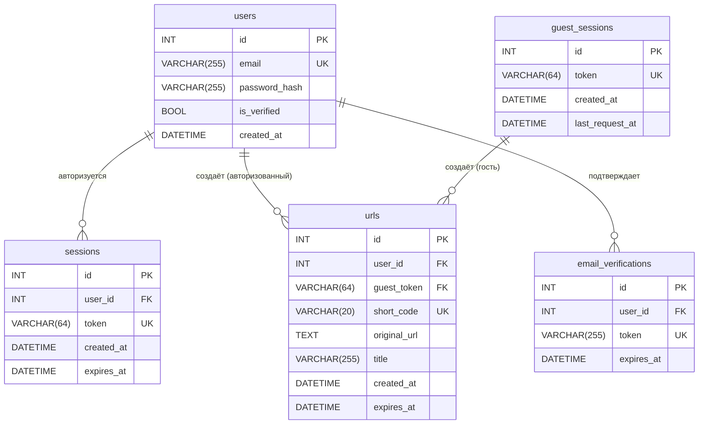

# Техническое задание
## Сервис сокращения ссылок

---

## 1. Общее описание

Публичный веб-сервис для сокращения URL-адресов. Пользователь вставляет длинную ссылку и получает короткую. При переходе по короткой ссылке происходит мгновенный редирект на оригинальный URL.

Фронтенд (index.html) предоставлен заказчиком и является макетом интерфейса, визуальная часть интерфейса должна быть такой же.

---

## 2. Роли пользователей

### 2.1 Гость (не авторизован)
- Может создать короткую ссылку
- Ссылка живёт **не более 15 минут** после создания
- Список своих ссылок не доступен
- Не может удалить ссылку

### 2.2 Зарегистрированный пользователь
- Может создать короткую ссылку с временем жизни **до 1 дня**
- Видит список всех своих ссылок с пагинацией
- Может удалить ссылку
- Может задать название ссылки
- Может создать новую ссылку взамен удалённой («перевыпустить»)
- Одновременно активных ссылок — **не более 3**

---

## 3. Функциональные требования

### 3.1 Регистрация и вход

#### Регистрация
- Принимает: email + пароль
- При регистрации отправляется письмо с ссылкой подтверждения
- Форма защищена CAPTCHA
- Пароль хранится в виде хеша (bcrypt или аналог)

#### Схема аутентификации: Basic → Bearer

**Шаг 1. Логин через Basic Auth**
```
POST /api/auth/login
Authorization: Basic base64("email:password")

← 200 OK
{ "token": "a1b2c3d4...", "expires_at": "2026-03-18T10:00:00Z" }
```
Клиент сохраняет токен в `localStorage`.

**Шаг 2. Защищённые запросы через Bearer**
```
GET /api/urls
Authorization: Bearer a1b2c3d4...
```
Сервер ищет токен в таблице `sessions`, проверяет `expires_at`, извлекает `user_id`.

**Гостевые запросы** (с анонимным токеном)
```
POST /api/shorten
X-Guest-Token: g_a1b2c3d4...
```
Гость идентифицируется по `X-Guest-Token` — анонимному токену без привязки к личности.
Токен выдаётся при первом обращении и хранится в `localStorage` на клиенте.
Сервер находит токен в таблице `guest_sessions` → применяет лимиты для этого гостя.

Если `X-Guest-Token` отсутствует → сервер создаёт новую запись в `guest_sessions`, возвращает токен в ответе:
```json
{ "short_url": "...", "expires_at": "...", "guest_token": "g_a1b2c3d4..." }
```

#### Логика идентификации запроса на сервере

| Ситуация | Кто это | Действие |
|----------|---------|----------|
| `Authorization: Bearer <token>` — найден, не истёк | Авторизованный пользователь | `user_id` из `sessions`, лимиты авторизованного |
| `Authorization: Bearer <token>` — не найден или истёк | — | `401 Unauthorized` |
| `X-Guest-Token: g_...` — найден в `guest_sessions` | Знакомый гость | Применить лимиты по `guest_token` |
| Нет ни одного заголовка | Новый гость | Создать `guest_sessions`, вернуть `guest_token` в ответе |

#### Logout
```
POST /api/auth/logout
Authorization: Bearer a1b2c3d4...
```
Сервер удаляет запись из таблицы `sessions` → токен становится недействительным немедленно.

### 3.2 Создание короткой ссылки

**Входные данные:**
- `url` — оригинальный URL (обязательно)
- `title` — название ссылки (опционально, только для авторизованных)
- `expires_at` — дата/время истечения (опционально, в пределах лимита роли)

**Поведение:**
- Принимать только URL с протоколом `http://` или `https://`
- Если пользователь ввёл URL без протокола — показать предупреждение, **не** добавлять `https://` автоматически
- Валидировать корректность структуры домена
- Генерировать уникальный случайный короткий код (буквы + цифры)
- Длина кода — динамическая, растёт по мере заполнения пространства кодов (старт: 6 символов)
- Каждый пользователь получает **свой уникальный код** для одного и того же URL
- Для гостей: не сохранять ссылку в профиль, ссылка удаляется по истечении 15 минут

**API:** `POST /api/shorten`
Тело запроса: `{ url, title?, expires_at? }`
Ответ: `{ short_code, short_url, expires_at }`

### 3.3 Редирект

- При переходе по `/{short_code}` — мгновенный HTTP 302 редирект на оригинальный URL
- Если ссылка истекла или удалена — показать страницу «Ссылка недействительна»
- Статистику переходов **не собирать** (см. раздел 6)

### 3.4 Список ссылок (только авторизованные)

**API:** `GET /api/urls?page=1&limit=20&sort=created_at&order=desc`

- Показывать все ссылки пользователя с пагинацией
- Сортировка по умолчанию: сначала новые
- Дополнительные варианты сортировки: по дате истечения, по алфавиту названия
- Обновление списка — только вручную (кнопка «Обновить»)

Поля в ответе на каждую ссылку:
```json
{
  "id": 1,
  "short_code": "abc123",
  "short_url": "https://site.ru/abc123",
  "original_url": "https://...",
  "title": "Название",
  "created_at": "2026-03-17T10:00:00Z",
  "expires_at": "2026-03-18T10:00:00Z"
}
```

### 3.5 Удаление ссылки

- Авторизованный пользователь может удалить любую свою ссылку
- После удаления переход по короткому коду возвращает страницу «Ссылка недействительна»
- После удаления пользователь может создать новую ссылку (лимит в 3 активные ссылки освобождается)

**API:** `DELETE /api/urls/{short_code}`

### 3.6 Название ссылки

- Авторизованный пользователь может задать `title` при создании ссылки
- Отображается в списке вместо (или рядом с) оригинального URL

---

## 4. Ограничения и лимиты

| Параметр | Гость | Авторизованный |
|----------|-------|----------------|
| Макс. время жизни ссылки | 15 минут | 1 день (24 часа) |
| Макс. активных ссылок одновременно | 1 | 3 |
| Просмотр списка ссылок | нет | да |
| Удаление ссылок | нет | да |
| Кастомный код | нет | нет |
| Макс. запросов к API (Rate Limit) | 10 в минуту на `guest_token` | 30 в минуту на `user_id` |

### 4.1 Защита от DDoS (Rate Limiting)

Лимиты считаются **независимо** для каждого идентификатора:
- Гость — по `guest_token` из таблицы `guest_sessions`
- Авторизованный — по `user_id` из таблицы `sessions`

Превышение лимита → `429 Too Many Requests` + заголовок `Retry-After: <секунды>`.

Окно подсчёта — скользящая минута (sliding window): сервер хранит время последних запросов и отбрасывает те, что старше 60 секунд.

---

## 5. Нефункциональные требования

- **Домен:** один домен для всего сервиса
- **Редирект:** HTTP 302 (временный), мгновенный, без промежуточных страниц
- **Протоколы:** только HTTP/HTTPS ссылки принимаются на вход
- **Масштабируемость кодов:** длина short_code растёт автоматически при нехватке пространства

---

## 6. Сбор данных и конфиденциальность

> ⚠️ Сбор любой пользовательской статистики **строго запрещён**.

- **Не хранить** IP-адреса переходов
- **Не хранить** информацию о браузере, устройстве, стране пользователя
- **Не считать** количество кликов по ссылкам
- Поле `clicks` из демо-фронтенда **не реализовывать** на бэкенде
- Хранить только: сами ссылки, их коды, время создания, время истечения, владельца

---

## 7. API — полный список эндпоинтов

| Метод | Путь | Описание | Заголовок авторизации |
|-------|------|----------|-----------------------|
| `GET` | `/api/guest-token` | Получить анонимный гостевой токен | нет |
| `POST` | `/api/shorten` | Создать короткую ссылку | `X-Guest-Token` или `Bearer <token>` |
| `GET` | `/api/urls` | Список своих ссылок | `Bearer <token>` (обязательно) |
| `DELETE` | `/api/urls/{code}` | Удалить ссылку | `Bearer <token>` (обязательно) |
| `POST` | `/api/auth/register` | Регистрация | нет |
| `POST` | `/api/auth/login` | Вход, получить токен | `Basic base64(email:password)` |
| `POST` | `/api/auth/logout` | Выход, удалить токен | `Bearer <token>` (обязательно) |
| `GET` | `/{code}` | Редирект по короткому коду | нет |

---

## 8. ER-диаграмма — таблицы БД



### Описание полей

#### `users`
| Поле | Тип | Описание |
|------|-----|----------|
| `id` | INT PK | Идентификатор |
| `email` | VARCHAR(255) UNIQUE | Email пользователя |
| `password_hash` | VARCHAR(255) | Хеш пароля |
| `is_verified` | BOOL | Подтверждён ли email |
| `created_at` | DATETIME | Дата регистрации |

#### `sessions`
| Поле | Тип | Описание |
|------|-----|----------|
| `id` | INT PK | Идентификатор |
| `user_id` | INT FK → users.id | Владелец сессии |
| `token` | VARCHAR(64) UNIQUE | Случайный Bearer-токен |
| `created_at` | DATETIME | Время создания |
| `expires_at` | DATETIME | Время истечения сессии |

#### `guest_sessions`
| Поле | Тип | Описание |
|------|-----|----------|
| `id` | INT PK | Идентификатор |
| `token` | VARCHAR(64) UNIQUE | Анонимный гостевой токен (`g_...`) |
| `created_at` | DATETIME | Время создания |
| `last_request_at` | DATETIME | Время последнего запроса (для rate limit) |

#### `urls`
| Поле | Тип | Описание |
|------|-----|----------|
| `id` | INT PK | Идентификатор |
| `user_id` | INT FK → users.id NULL | Владелец-пользователь (NULL для гостей) |
| `guest_token` | VARCHAR(64) FK → guest_sessions.token NULL | Владелец-гость (NULL для авторизованных) |
| `short_code` | VARCHAR(20) UNIQUE | Короткий код |
| `original_url` | TEXT | Оригинальный URL |
| `title` | VARCHAR(255) NULL | Название ссылки |
| `created_at` | DATETIME | Дата создания |
| `expires_at` | DATETIME | Дата истечения |

#### `email_verifications`
| Поле | Тип | Описание |
|------|-----|----------|
| `id` | INT PK | Идентификатор |
| `user_id` | INT FK → users.id | Пользователь |
| `token` | VARCHAR(255) UNIQUE | Токен подтверждения |
| `expires_at` | DATETIME | Срок действия токена |

---

## 9. Сценарии работы системы

> Каждый сценарий описывает полную цепочку действий: что делает клиент → что проверяет сервер → что происходит в БД → что возвращается клиенту.

---

### Сценарий 1. Первое обращение гостя (получение guest_token)

**Триггер:** клиент открывает страницу, в `localStorage` нет `guest_token`.

```
Клиент → GET /api/guest-token
         (без заголовков)
```

1. Сервер получает запрос.
2. Генерирует случайную строку с префиксом `g_` длиной 64 символа.
3. Создаёт запись в `guest_sessions`: `token = g_xxx`, `created_at = now`, `last_request_at = now`.
4. Возвращает токен клиенту.

```json
← 200 OK
{ "guest_token": "g_a1b2c3d4..." }
```

5. Клиент сохраняет `guest_token` в `localStorage`.
6. Все последующие запросы клиент отправляет с заголовком `X-Guest-Token: g_a1b2c3d4...`.

**Ошибок нет** — этот эндпоинт всегда возвращает 200.

---

### Сценарий 2. Гость создаёт короткую ссылку

**Триггер:** гость вводит URL и нажимает «Сократить».

```
Клиент → POST /api/shorten
         X-Guest-Token: g_a1b2c3d4...
         { "url": "https://example.com/very-long-url" }
```

1. Сервер читает заголовок `X-Guest-Token`.
2. Ищет токен в `guest_sessions`. Если не найден → `401 Unauthorized` (токен устарел или подделан, клиент должен запросить новый через `/api/guest-token`).
3. **Rate limit:** считает количество запросов от этого `guest_token` за последние 60 секунд по таблице `urls` (поле `created_at`). Если ≥ 10 → `429 Too Many Requests`, заголовок `Retry-After: <секунды до конца окна>`.
4. **Лимит активных ссылок:** считает `COUNT(*) FROM urls WHERE guest_token = ? AND expires_at > now`. Если ≥ 1 → `429 Too Many Requests`, тело `{ "error": "active_link_limit", "message": "У вас уже есть активная ссылка" }`.
5. **Валидация URL:**
   - Проверяет, что URL начинается с `http://` или `https://`. Если нет → `400 Bad Request`, `{ "error": "invalid_url_scheme" }`.
   - Проверяет корректность структуры домена (наличие TLD, отсутствие пробелов и т.д.). Если некорректно → `400 Bad Request`, `{ "error": "invalid_url_format" }`.
6. **Генерация короткого кода:**
   - Берёт текущую длину кода (начинается с 6 символов).
   - Генерирует случайную строку из `[a-zA-Z0-9]`.
   - Проверяет уникальность в `urls`. Если коллизия — повторяет генерацию (до 5 попыток).
   - Если за 5 попыток не нашёл свободный — увеличивает длину кода на 1 и повторяет.
7. Создаёт запись в `urls`: `guest_token = g_xxx`, `user_id = NULL`, `short_code = abc123`, `original_url = ...`, `expires_at = now + 15 минут`.
8. Обновляет `last_request_at` в `guest_sessions`.
9. Возвращает результат.

```json
← 201 Created
{
  "short_code": "abc123",
  "short_url": "https://site.ru/abc123",
  "expires_at": "2026-03-17T10:15:00Z"
}
```

---

### Сценарий 3. Регистрация нового пользователя

**Триггер:** пользователь заполняет форму регистрации.

```
Клиент → POST /api/auth/register
         { "email": "user@mail.ru", "password": "секретный_пароль" }
         + результат CAPTCHA
```

1. Сервер проверяет CAPTCHA-токен через внешний API. Если невалиден → `400 Bad Request`, `{ "error": "captcha_failed" }`.
2. Проверяет, что `email` валиден по формату. Если нет → `400`.
3. Ищет в `users` запись с таким `email`. Если существует → `409 Conflict`, `{ "error": "email_taken" }`.
4. Хеширует пароль (bcrypt, cost factor ≥ 12).
5. Создаёт запись в `users`: `email`, `password_hash`, `is_verified = false`, `created_at = now`.
6. Генерирует случайный токен подтверждения (64 символа).
7. Создаёт запись в `email_verifications`: `user_id`, `token`, `expires_at = now + 24 часа`.
8. Отправляет письмо на `email` со ссылкой вида `https://site.ru/verify?token=xxx`.
9. Возвращает ответ.

```json
← 201 Created
{ "message": "Письмо с подтверждением отправлено на user@mail.ru" }
```

**Подтверждение email:**

```
Клиент → GET /verify?token=xxx  (пользователь кликает ссылку из письма)
```

1. Сервер ищет токен в `email_verifications`. Если не найден → страница «Ссылка недействительна».
2. Проверяет `expires_at > now`. Если истёк → страница «Ссылка истекла, запросите новую».
3. Устанавливает `users.is_verified = true`.
4. Удаляет запись из `email_verifications`.
5. Перенаправляет пользователя на страницу входа с сообщением «Email подтверждён».

---

### Сценарий 4. Вход (логин) пользователя

**Триггер:** пользователь вводит email и пароль.

```
Клиент → POST /api/auth/login
         Authorization: Basic base64("user@mail.ru:секретный_пароль")
```

1. Сервер декодирует `Authorization: Basic`, извлекает `email` и `password`.
2. Ищет пользователя в `users` по `email`. Если не найден → `401 Unauthorized`, `{ "error": "invalid_credentials" }` (не уточнять, что именно неверно — email или пароль).
3. Проверяет `is_verified = true`. Если нет → `403 Forbidden`, `{ "error": "email_not_verified" }`.
4. Сравнивает пароль с `password_hash` через bcrypt. Если не совпадает → `401 Unauthorized`, `{ "error": "invalid_credentials" }`.
5. Генерирует случайный Bearer-токен (64 символа).
6. Создаёт запись в `sessions`: `user_id`, `token`, `created_at = now`, `expires_at = now + 7 дней`.
7. Возвращает токен клиенту.

```json
← 200 OK
{ "token": "a1b2c3d4...", "expires_at": "2026-03-24T10:00:00Z" }
```

8. Клиент сохраняет `token` в `localStorage`. Все последующие запросы — с заголовком `Authorization: Bearer a1b2c3d4...`.

---

### Сценарий 5. Авторизованный пользователь создаёт ссылку

**Триггер:** авторизованный пользователь вводит URL и нажимает «Сократить».

```
Клиент → POST /api/shorten
         Authorization: Bearer a1b2c3d4...
         { "url": "https://example.com/...", "title": "Моя ссылка", "expires_at": "2026-03-18T10:00:00Z" }
```

1. Сервер читает заголовок `Authorization: Bearer`.
2. Ищет токен в `sessions`. Если не найден → `401 Unauthorized`.
3. Проверяет `sessions.expires_at > now`. Если истёк → `401 Unauthorized`.
4. Извлекает `user_id` из найденной сессии.
5. **Rate limit:** считает запросы от этого `user_id` за последние 60 секунд. Если ≥ 30 → `429 Too Many Requests`.
6. **Лимит активных ссылок:** `COUNT(*) FROM urls WHERE user_id = ? AND expires_at > now`. Если ≥ 3 → `429 Too Many Requests`, `{ "error": "active_link_limit", "message": "Достигнут лимит в 3 активные ссылки" }`.
7. **Валидация `expires_at`** (если передан): не должен превышать `now + 24 часа`. Если превышает → `400 Bad Request`, `{ "error": "expires_too_far" }`.
8. Валидация URL — аналогично сценарию 2 (шаги 5).
9. Генерация `short_code` — аналогично сценарию 2 (шаги 6).
10. Создаёт запись в `urls`: `user_id = ?`, `guest_token = NULL`, `short_code`, `original_url`, `title`, `expires_at`.
11. Возвращает результат.

```json
← 201 Created
{
  "short_code": "xyz789",
  "short_url": "https://site.ru/xyz789",
  "title": "Моя ссылка",
  "expires_at": "2026-03-18T10:00:00Z"
}
```

---

### Сценарий 6. Переход по короткой ссылке (редирект)

**Триггер:** кто угодно открывает `https://site.ru/abc123` в браузере.

```
Браузер → GET /abc123
```

1. Сервер извлекает `short_code = "abc123"` из пути.
2. Ищет запись в `urls` по `short_code`. Если не найдена → показывает HTML-страницу «Ссылка не существует» (404).
3. Проверяет `expires_at > now`. Если истекла → показывает HTML-страницу «Ссылка недействительна» (410 Gone).
4. Возвращает редирект.

```
← 302 Found
Location: https://example.com/very-long-url
```

5. Браузер автоматически переходит на `Location`.
6. **Никакие данные о переходе не сохраняются** (ни IP, ни время, ни браузер).

---

### Сценарий 7. Просмотр списка своих ссылок

**Триггер:** авторизованный пользователь открывает раздел «Недавние ссылки».

```
Клиент → GET /api/urls?page=1&limit=20&sort=created_at&order=desc
         Authorization: Bearer a1b2c3d4...
```

1. Сервер проверяет Bearer-токен (аналогично сценарию 5, шаги 1–4).
2. Выполняет запрос:
   ```sql
   SELECT id, short_code, original_url, title, created_at, expires_at
   FROM urls
   WHERE user_id = ?
   ORDER BY created_at DESC
   LIMIT 20 OFFSET 0
   ```
3. Считает общее количество ссылок пользователя для пагинации.
4. Возвращает результат.

```json
← 200 OK
{
  "data": [
    {
      "short_code": "xyz789",
      "short_url": "https://site.ru/xyz789",
      "original_url": "https://example.com/...",
      "title": "Моя ссылка",
      "created_at": "2026-03-17T10:00:00Z",
      "expires_at": "2026-03-18T10:00:00Z"
    }
  ],
  "pagination": {
    "page": 1,
    "limit": 20,
    "total": 3,
    "pages": 1
  }
}
```

---

### Сценарий 8. Удаление ссылки

**Триггер:** авторизованный пользователь нажимает «Удалить» у одной из своих ссылок.

```
Клиент → DELETE /api/urls/xyz789
         Authorization: Bearer a1b2c3d4...
```

1. Сервер проверяет Bearer-токен (шаги 1–4 из сценария 5).
2. Ищет ссылку в `urls` по `short_code = "xyz789"`. Если не найдена → `404 Not Found`.
3. Проверяет, что `urls.user_id = user_id` из токена. Если чужая ссылка → `403 Forbidden`.
4. Удаляет запись из `urls`.
5. Возвращает подтверждение.

```json
← 200 OK
{ "message": "Ссылка удалена" }
```

6. После удаления переход по `https://site.ru/xyz789` вернёт страницу «Ссылка не существует».
7. Лимит активных ссылок пользователя уменьшается на 1 (проверяется динамически через COUNT).

---

### Сценарий 9. Выход (logout)

**Триггер:** пользователь нажимает «Выйти».

```
Клиент → POST /api/auth/logout
         Authorization: Bearer a1b2c3d4...
```

1. Сервер ищет токен в `sessions`. Если не найден → `401 Unauthorized`.
2. Удаляет запись из `sessions`.
3. Возвращает подтверждение.

```json
← 200 OK
{ "message": "Вы вышли из системы" }
```

4. Клиент удаляет `token` из `localStorage`.
5. Повторное использование старого токена → `401 Unauthorized` (запись в `sessions` удалена).

---

## 10. Что не входит в scope

- Кастомные короткие коды (пользователь не выбирает «хвостик»)
- Несколько доменов
- QR-коды
- Статистика переходов и аналитика
- Редактирование оригинального URL (только удаление и создание новой)
- Экспорт списка ссылок
- Авторизация через соцсети (OAuth)
- Поиск по списку ссылок
- Автообновление списка
